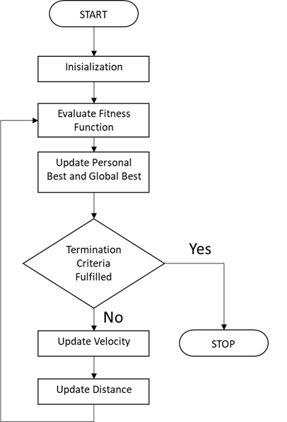
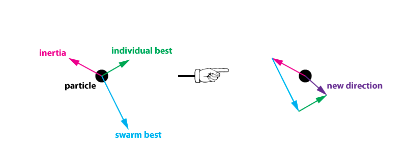
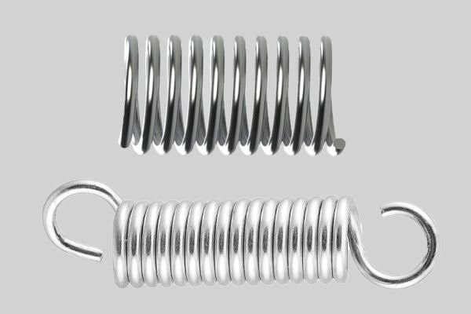

```{r setup, include=FALSE}
knitr::opts_chunk$set(echo = TRUE,
                      fig.align = "center")
```

# Introduction {.tabset .tabset-fade .tabset-pills}

## About

Optimization is important in many fields, including in data science. In manufacturing, where every decision is critical to the process and the profit of organization, optimization is often employed, from the number of each products produced, how the unit is scheduled for production, get the best or optimal process parameter, and also the routing determination such as the traveling salesman problem. In data science, we are familiar with model tuning, where we tune our model in order to improve the model performance. Optimization algorithm can help us to get a better model performance. 

Particle Swarm Optimization (PSO) is one of many optimization algorithm that is inspired by nature. PSO mimics the behaviour of flock of bird or school of fish. PSO shares many similarities with evolutionary computation techniques such as Genetic Algorithms (GA). It is initialized with a pool/group of random solutions and searches for optima by updating through iterations. In PSO, the potential solutions, called particles/agents, move through the problem space by following the current optimum particles. 

This post is dedicated to learn how PSO works and their application in various business and data science case. The algorithm will be run in R.

## Learning Objectives

* Learn how Particle Swarm Optimization (PSO) works
* Learn how to apply PSO in business and data science problem
* Compare PSO with Genetic Algorithm

## Library and Setup

The following is list of packages that will be used throughout the articles.

```{r message=FALSE}
library(tidyverse)
library(ranger)
library(tidymodels)
library(caret)
library(pso)
library(GA)
library(lubridate)
library(scales)

options(scipen = 999)
```

# Particle Swarm Optimization: General Concept

PSO is inspired by social behaviour of animals, such us flock of bird or school of fish. The swarm doesn’t fully explore the search space but potentially finds a better solution.

```{r out.width="80%", echo=FALSE, eval =TRUE}

```

The general workflow of PSO is illustrated with below figure.

```{r out.width="40%", echo=FALSE, eval =TRUE}

```

PSO is initialized with a group of random particles (solutions) and then searches for optima by updating generations. Each individuals is treated as a single solution, called particle, that will move through the solution space searching for global optima. The particles movement direction and velocity are determined by 3 components: inertia, individual best/cognitive force, and swarm best/social force. 

Personal best is the best solution (fitness) it has achieved so far. Meanwhile, global best is the best or optimal value tracked by the particle swarm optimizer obtained so far by any particle in the population. If the algorithm stop to run, the global best value would be the optimal value. There are constant for each best value that will determine their importance to calculate the movement of the particle.

Inertia weight is applied in order to better control the scope of the search. This weight is multiplied with the velocity at the previous time step. This parameter controls the exploration of the search space, so that a high value allows particles to move with large velocities in order to find the global optimum neighborhood in a fast way and a low value can narrow the particles search region[^1]. 

Initially the inertia weight was kept static during the entire search process for every particle and dimension. However, with the due course of time dynamic inertia weights were introduced. For example, by linearly decreasing the inertia weight from a relatively large value to a small value through the course of the PSO run, the PSO tends to have more global search ability at the beginning of the run while having more local search ability near the end of the run[^2]. 

```{r out.width="80%", echo=FALSE, eval =TRUE}

```

The rate of the position change (velocity) is calculated with the following equation:

$$V_{id} = W * V_{id} + c_1 * rand[0,1] * (P_{id}-X_{id}) + c_2 * rand[0,1] * (G_{id}-X_{id})$$

$V_{id}$ : Particle velocity

$W$ : Inertia Weight

$c_1, c_2$ : constant

$rand[0,1]$ : Random number ranging from 0 to 1

$X_{id}$ : Current solution from each individuals

$P_{id}$ : Personal Best, the best solution from each individuals

$G_{id}$ : Global Best, the best solution from the whole population

The new position of the particle would be:

$$X_{id} = X_{id} + V_{id}$$

Below is an illustration on how PSO works:

```{r out.width="60%", echo=FALSE, eval =TRUE}
knitr::include_graphics("asset/PSO.gif")
```

# Particle Swarm Optimization in R

PSO can be implemented in R using the `pso` package. So far, the implementation of PSO in those package are limited to continuous optimization, one which requires real-valued or continuous variables.

## Business Application

### Engineering: Optimizing Spring Weight

```{r out.width="60%", echo=FALSE, eval =TRUE}

```

The problem is replicated from Hu et al.(2003)[^3]. The problem consists of minimizing the weight of a tension/compression spring with subject to constraints on minimum deflection, shear stress, surge frequency, limits on outside diameter and on design variables. The design variables are the mean coil diameter `D`, the wire diameter `d` and the number of active coils `N`. The problem can be expressed as follows:

$$Minimize \ f(x) = (N+2) D * d^2$$

**Subject to:**

$$g_1(x) = 1 - \frac{D^3N}{71785 \ d^4} \leq 0$$
$$g_2(x) = \frac{4D^2 - d D}{12566(D d^3 - d^4)} + \frac{1}{5108 d^2} -1 \leq 0$$

$$g_3(x) = 1 - \frac{140.45 d}{D^2 N} \leq 0 $$

$$g_4(x) = \frac{D+d}{1.5}-1 \leq 0$$

The following ranges for the variables were used: 

$$0.05 \leq x_1 \leq 2.0$$
$$0.25 \leq x_2 \leq 1.3$$
$$2.0 \leq x_3 \leq 15.0$$

$x_1$ is the wire diameter d, $x_2$ is the coild diameter D, and $x_3$ is the number of active coils N. $x_1$ and $x_2$ is a continuous variables, while $x_3$ should be an integer, thus we need to round the number.

Let's write the fitness function in R. Since the problem is a minimization problem, we will penalized the fitness function that violated the constraint by adding them to a constant of 1,000.

```{r}
fitness <- function(x){
  d <- x[1]
  D <- x[2]
  N <- round(x[3])
  
  # define fitness function
  fitness_value <- (N+2)*D*d^2
  
  #define constraint
  g1 <- 1 - D^3*N/(71785*d^4)
  g2 <- (4*D^2-d*D)/(12566*(D * d^3 - d^4)) + 1/(5108 * d^2) - 1
  g3 <- 1 - (140.45*d)/(D^2*N)
  g4 <- (D+d)/1.5 - 1
  
  #penalized constraint violation
  fitness_value <- ifelse( g1 <= 0 & g2 <= 0 & g3 <= 0 & g4 <= 0, fitness_value, fitness_value + 1e3 )
  
  return(fitness_value)
}
```

To run PSO algorithm, we use the function `psoptim()` from `pso` package. The parameter includes:

* `par`: vector with length defining the dimensionality of the optimization problem. Can be filled with actual value or NA.
* `fn` : fitness function
* `lower`: the lower bound of each variable(s)
* `upper`: the upper bound of each variable(s)
* `control`: the control parameter for PSO algorithm

By default, `psoptim()` run in 1000 iterations with population size of 40. Since PSO is a stochastic algorithm, first we set the seed first so we can have same result.

```{r}
set.seed(90)
psoptim(rep(NA,3), fn = fitness, lower = c(0.05, 0.25, 2), upper = c(2, 1.3, 15))
```

The `psoptim` return list of 5 objects: 

* `par`: the optimal parameter/values for each variables
* `value`: the optimal fitness value
* `counts`: A three-element vector containing the number of function evaluations, the number of iterations, and the number of restarts
* `convergence`: An integer code. 0 indicates that the algorithm terminated by reaching the absolute tolerance; otherwise: 
   - 1: Maximal number of function evaluations reached
   - 2: Maximal number of iterations reached.
   - 3: Maximal number of restarts reached.
   - 4: Maximal number of iterations without improvement reached
* `message`: A descriptive message of the reason for termination.

The optimum fitness value is quite similar with the result of the study.

To control the parameter of PSO, we can make a list of control parameters in the `control` argument. Here, we try to set the maximum number of iteration (`maxit`) to 2000 and population/swarm size (`s`) to 100. We can also adjust the intertia weight (`w`), personal best constant (`c.p`), and global best constant (`c.g`).

The complete list of available control and the default value can be looked at the package documentation[^5]. 

```{r}
set.seed(123)
psoptim(rep(NA,3), fn = fitness, lower = c(0.05, 0.25, 2), upper = c(2, 1.3, 15), 
        control = list(maxit = 2000, s = 100, w = 0.5, c.p = 0.4, c.g = 0.6))
```

Since PSO is a stochastic algorithm, let's run the initial PSO setting for 30 times and measure the mean and standard deviation of the optimum fitness values.

```{r}
pso_run <- numeric()

tictoc::tic()
for (i in 1:30) {
  x <- psoptim(rep(NA,3), fn = fitness, lower = c(0.05, 0.25, 2), upper = c(2, 1.3, 15))
  pso_run <- c(pso_run, x$value)
}
tictoc::toc()
```

Let's check the results.

```{r}
pso_run
```

Solution with fitness value around 1000 means that it violate the constraint (remember the penalized fitness value). Let's see the mean and standard deviation of fitness value that didn't violate constraint.

```{r}
mean(pso_run[pso_run < 10])
sd(pso_run[pso_run < 10])
```

Let's compare the performance of PSO with Genetic Algorithm (GA) from `GA` package. We will make the same algorithm run with same number of maximum iteration and population size.

```{r}
ga_run <- numeric()
tictoc::tic()
for (i in 1:30) {
  ga_spring <- ga(type = "real-valued", fitness = function(x) {-fitness(x)}, lower = c(0.05, 0.25, 2), upper = c(2, 1.3, 15), 
   maxiter = 1000, popSize = 100, monitor = F)  
  ga_run <- c(ga_run, -ga_spring@fitnessValue)
}
tictoc::toc()
```

Let's check the results
```{r}
ga_run
```

Let's see the mean and standard deviation of fitness value that didn't violate constraint.

```{r}
mean(ga_run)
sd(ga_run)
```

For this problem, with the same number of iteration and population size, PSO has better fitness value compared to GA. PSO also has far lower runtime. Perhaps the third variables (N), which is supossed to be integer but supplied with decimal value, has more severe effect for GA compared to PSO in finding the optima.

### Finance: Portofolio Optimization

The problem is replicated from Zhu et al.(2011)[^4]. The study employed a PSO algorithm for portfolio selection and optimization in investment management. 

Portfolio optimization problem is concerned with managing the portfolio of assets that minimizes the risk objectives subjected to the constraint for guaranteeing a given level of returns. One of the fundamental principles of financial investment is diversification where investors diversify their investments into different types of assets. Portfolio diversification minimizes investors exposure to risks, and maximizes returns on portfolios. 

The fitness function is the adjusted Sharpe Ratio for restricted portofolio, which combines the information from mean and variance of an asset and functioned as a risk-adjusted measure of mean return, which is often used to evaluate the performance of a portfolio. 

The Sharpe ratio can help to explain whether a portfolio's excess returns are due to smart investment decisions or a result of too much risk. Although one portfolio or fund can enjoy higher returns than its peers, it is only a good investment if those higher returns do not come with an excess of additional risk.

The greater a portfolio's Sharpe ratio, the better its risk-adjusted performance. If the analysis results in a negative Sharpe ratio, it either means the risk-free rate is greater than the portfolio’s return, or the portfolio's return is expected to be negative. 

The fitness function is shown below:

$$Max \  f(x) = \frac{\sum_{i=1}^{N} W_i*r_i - R_f}{\sum_{i=1}^{N}\sum_{j=1}^{N} W_i * W_j * \sigma_{ij}}$$

**Subject To**

$$\sum_{i=1}^{N} W_i = 1$$
$$0 \leq W_i \leq 1$$
$$i = 1, 2, ..., N$$

$N$: Number of different assets

$W_i$: Weight of each stock in the portfolio

$r_i$: Return of stock i

$R_f$: The test available rate of return of a risk-free security (i.e. the interest rate on a three-month U.S. Treasury bill)

$\sigma_{ij}$: Covariance between returns of assets i and j, 

Adjusting the portfolio weights $w_i$, we can maximize the portfolio Sharpe Ratio in effect balancing the trade-off between maximizing the expected return and at the same time minimizing the risk.

#### Import Data

Data is acquired from New York Stock Exchange on Kaggle (https://www.kaggle.com/dgawlik/nyse). We will only use data from January to March of 2015 for illustration. 

```{r}
nyse <- data.table::fread("data_input/prices_split.csv")

nyse <- nyse %>% 
  mutate(date = ymd(date)) %>% 
  filter(year(date) == 2015,
         month(date) %in% c(1:3))

head(nyse)
```

Let's say I have assets in 8 different stocks. I will randomly choose the stocks.

```{r}
set.seed(13)
selected_stock <- sample(nyse$symbol, 8)

nyse <- nyse %>% 
  filter(symbol %in% selected_stock)
head(nyse)
```

#### Calculate Returns

Let's calculate the daily returns.

```{r}
nyse <- nyse %>% 
  select(date, symbol, close) %>% 
  group_by(symbol) %>% 
  rename(price = close) %>% 
  mutate(price_prev = lag(price),
         returns = (price - price_prev)/price_prev) %>% 
  slice(-1) %>% 
  ungroup()

head(nyse)
```

Let's calculate the mean return of each stock.
```{r}
mean_stock <- nyse %>% 
  group_by(symbol) %>% 
  summarise(mean = mean(returns))

mean_stock
```

The value of $R_f$ is acquired from the latest interest rate on a three-month U.S. Treasury bill. Since the data is from 2016, we will use data from 2015 (Use data from March 27, 2015), which is 0.04%. The rate is acquired from https://ycharts.com/indicators/3_month_t_bill.
```{r}
rf <- 0.04/100
```

#### Covariance Matrix Between Portofolio

Calculate the covariance matrix between portofolio. First, we need to separate the return of each portofolio into several column by spreading them.

```{r}
nyse_wide <- nyse %>%
  pivot_wider(id_cols = c(date, symbol), names_from = symbol, values_from = returns) %>% 
  select(-date)

# Create Excess Return
for (i in 1:n_distinct(nyse$symbol)) {
  nyse_wide[,i]<- nyse_wide[,i] - as.numeric(mean_stock[i,2])
}
  
head(nyse_wide)
```

Create the covariance matrix.

```{r}
nyse_cov <- cov(x = nyse_wide)
nyse_cov
```

#### Define Fitness Function

Let's define the fitness function. We will penalize the solution that violate the constraint. Higher penalty will increases accuracy and force the fitness value to get closer to the feasible area.

```{r}
fitness <- function(x){
  # Assign weight for each stocks
  weight_stock <- numeric()
  for (i in 1:n_distinct(nyse$symbol)) {
    weight_stock[i] <- x[i]
  }
  
 # Calculate the numerator
 f1 <- numeric()
 for (i in 1:n_distinct(nyse$symbol)) {
   f1[i] <- weight_stock[i]*mean_stock$mean[i]
 }
   
 # Calculate the denominator
 f2 <- numeric()
 for (i in 1:n_distinct(nyse$symbol)) {
   f3 <- numeric()
   
   for (j in 1:n_distinct(nyse$symbol)) {
    f3[j] <- weight_stock[i]*weight_stock[j]*nyse_cov[i,j]
   }
   
 f2[i] <- sum(f3)
 }

  # Calculate Fitness Value
 fitness <- (sum(f1)-rf)/sum(f2)

 # Penalize Constraint Violation
 fitness <- fitness - 1e9 * (round(sum(weight_stock),10)-1)^2
 
 return(fitness)
}
```

#### Run the Algorithm

Let's optimize the weight with PSO. Since `psoptim()` by default is minimization problem, we will adjust the fitness function for maximization by multiplying the fitness value with negative sign.

```{r}
set.seed(123)
pso_finance <- psoptim(par = rep(NA,8), fn = function(x){-fitness(x)}, 
        lower = rep(0,8), upper = rep(1,8), 
        control = list(maxit = 10000, s = 100, maxit.stagnate = 500))

pso_finance
```

Let's check the total weight to see if the optimum value is a feasible solution
```{r}
sum(pso_finance$par)
```

The solutions has Sharpe Ratio of `r -pso_finance$value`. The greater a portfolio's Sharpe ratio, the better its risk-adjusted performance. If the analysis results in a negative Sharpe ratio, it either means the risk-free rate is greater than the portfolio’s return, or the portfolio's return is expected to be negative. 

To get clearer name of company, let's import the Ticker Symbol and Security.

```{r}
securities <- data.table::fread("data_input/securities.csv")
securities <- securities %>% 
  select(`Ticker symbol`, Security) %>% 
  rename(stock = `Ticker symbol`)
```

Based on PSO, here is how your asset should be distributed. 

```{r warning=FALSE}
data.frame(stock = unique(nyse$symbol),
           weight = pso_finance$par) %>% 
  arrange(desc(weight)) %>% 
  mutate(weight = percent(weight, accuracy = 0.001)) %>% 
  left_join(securities, by = "stock") %>% 
  select(stock, Security, weight)
```

#### Compare with Genetic Algorithm

Let's try to optimize the same problem with Genetic Algorithm.

```{r}
ga_finance <- ga(type = "real-valued", fitness = fitness, monitor = F,
                 lower = rep(0,8), upper = rep(1,8), popSize = 100, seed = 123, 
                 names = as.character(unique(nyse$symbol)), pmutation = 0.2,
                 maxiter = 10000, run = 500, selection = gareal_tourSelection)
summary(ga_finance)
```

Let's check the total weight

```{r}
sum(ga_finance@solution)
```

Fitness value resulted from GA (`r ga_finance@fitnessValue`) has lower Sharpe Ratio compared to those acquired with PSO.

Based on GA, here is how the distribution between portofolios.

```{r warning=FALSE}
data.frame(stock = unique(nyse$symbol),
           weight = as.numeric(ga_finance@solution)) %>% 
  arrange(desc(weight)) %>% 
  mutate(weight = percent(weight, accuracy = 0.001)) %>% 
  left_join(securities, by = "stock") %>% 
  select(stock, Security, weight)
```

## Machine Learning Application

For machine learning application, we will illustrate with hyper-parameter tuning for Random Forest model on attrition problem.

### Import Data

```{r}
attrition <- read.csv("data_input/attrition.csv")

attrition <- attrition %>% 
  mutate(job_involvement = as.factor(job_involvement),
         education = as.factor(education),
         environment_satisfaction = as.factor(environment_satisfaction),
         performance_rating = as.factor(performance_rating),
         relationship_satisfaction = as.factor(relationship_satisfaction),
         work_life_balance = as.factor(work_life_balance),
         attrition = factor(attrition, levels = c("yes", "no")))

attrition
```

### Cross-Validation

We split the data into training set and testing dataset, with 80% of the data will be used as the training set.

```{r}
set.seed(123)
intrain <- initial_split(attrition, prop = 0.8, strata = "attrition")

intrain
```

### Data Preprocessing

We will preprocess the data with the following step:

* Upsample to increase the number of the minority class and prevent class imbalance
* Scaling all of the numeric variables
* Remove numeric variable with near zero variance
* Use PCA to reduce dimensions with threshold of 90% information kept
* Remove `over_18` variable since it only has 1 levels of factor

```{r}
rec <- recipe(attrition ~ ., data = training(intrain)) %>% 
  step_upsample(attrition) %>% 
  step_scale(all_numeric()) %>% 
  step_nzv(all_numeric()) %>% 
  step_pca(all_numeric(), threshold = 0.9) %>% 
  step_rm(over_18) %>% 
  prep()

data_train <- juice(rec)
data_test <- bake(rec, testing(intrain))

data_train
```

### Create Fitness Function

We will train the model using `random forest`. We will optimize the `mtry` (number of nodes in each tree) and the `min_n` (minimum number of member on each tree in order to be splitted) value by maximizing the model accuracy on the testing dataset. We will set the range of `mtry` from 1 to 17. We will limit the range of `min_n` from 1 to 128. Let's check how many bits we need to cover those numbers.

We will write the model as fitness function. We will maximize the accuracy of our model on the testing dataset.

```{r}
fit_function <- function(x){
  a <- round(x[1])
  b <- round(x[2])
  
#define model spec
model_spec <- rand_forest(
  mode = "classification",
  mtry = a,
  min_n = b,
  trees = 500)

#define model engine
model_spec <- set_engine(model_spec,
                         engine = "ranger",
                         seed = 123,
                         num.threads = parallel::detectCores(),
                         importance = "impurity")

#model fitting
set.seed(123)
model <- fit_xy(
  object = model_spec,
  x = select(data_train, -attrition),
  y = select(data_train, attrition)
)

pred_test <- predict(model, new_data = data_test %>% select(-attrition))
acc <- accuracy_vec(truth = data_test$attrition, estimate = pred_test$.pred_class)
return(acc)
}
```

### Run the Algorithm

We will run the PSO with maximum 1000 iterations and stop if there is no improvement in 10 iterations. The swarm size will be increased to 100. Vectorizing the process may speed up the runtime.

```{r}
tictoc::tic()
psoptim(par = rep(NA,2), fn = fit_function, lower = c(1,1), upper = c(17, 128), 
        control = list(maxit = 1000, maxit.stagnate = 10, vectorize = T, s = 100))
tictoc::toc()
```

The optimum accuracy is around only 72%. It seems that PSO with continuous variables, even though it is rounded to get integer value, is trapped in local optima and has difficulty to move to the global optima due to the rounding value.

### Compare with Genetic Algorithm

Let's see if PSO with continuous variables can achieve the same result as GA with binary encoding. We will adjust the fitness function to be suitable for binary encoding. For more explanation of GA, you can check on my another post[^6].

```{r}
fit_function <- function(x){
  a <- binary2decimal(x[1:5])
  b <- binary2decimal(x[6:12])
  
  if (a == 0) {
    a <- 1
  }
  if (b == 0) {
    b <- 1
  }
  if (a > 17) {
    a <- 17
  }
  
#define model spec
model_spec <- rand_forest(
  mode = "classification",
  mtry = a,
  min_n = b,
  trees = 500)

#define model engine
model_spec <- set_engine(model_spec,
                         engine = "ranger",
                         seed = 123,
                         num.threads = parallel::detectCores(),
                         importance = "impurity")

#model fitting
set.seed(123)
model <- fit_xy(
  object = model_spec,
  x = select(data_train, -attrition),
  y = select(data_train, attrition)
)

pred_test <- predict(model, new_data = data_test %>% select(-attrition))
acc <- accuracy_vec(truth = data_test$attrition, estimate = pred_test$.pred_class)
return(acc)
}
```

Let's run the algorithm

```{r}
tictoc::tic()
ga_rf <- ga(type = "binary", fitness = fit_function, nBits = 12, seed = 123, 
            popSize = 100, maxiter = 100, run = 10, parallel = T, 
            selection = gabin_tourSelection)
summary(ga_rf)
tictoc::toc()
```

Genetic Algorithm with binary encoding can achieve far higher accuracy (88%) compared to previous PSO algorithm. Due to the unique nature of the encoding system in GA, it can achieve optima better than PSO for this case. GA with parallelization is also has faster runtime than the PSO.

# Conclusion

Particle Swarm Optimization is an optimization algorithm that apply swarm intelligence for efficiently move through the solution space. Based on some illustrated cases in business problem and in data science field, PSO generally work better than Genetic Algorithm, especially with less runtime. However, so far PSO can only be implemented with continuous variables, unlike GA that can encoded using either binary, real valued or even permutation to suit the problem better.

# Reference

[^1]: [Eslami, M., Shareef, H., Khajehzadeh, M., and Azah, M. 2012. A Survey of the State of the Art in Particle Swarm
Optimization](https://works.bepress.com/mahdiyeh_eslami/35/download/)
[^2]: [Shi, Yuhi and Russell C. Eberhart. 1995. Empirical Study of Particle Swarm Optimization](https://ieeexplore.ieee.org/document/785511)
[^3]: [Xiaohui Hu, Eberhart, R. C., & Yuhui Shi. 2003. Engineering optimization with particle swarm.](https://ieeexplore.ieee.org/abstract/document/1202247)
[^4]: [Zhu, H., Wang, Y., Wang, K., & Chen, Y. (2011). Particle Swarm Optimization (PSO) for the constrained portfolio optimization problem](https://dl.acm.org/citation.cfm?id=1968112)
[^5]: [CRAN: pso package documentation](https://cran.r-project.org/web/packages/pso/pso.pdf)
[^6]: [Adyatama, Arga. Optimization with Genetic Algorithm](http://rpubs.com/Argaadya/550805)